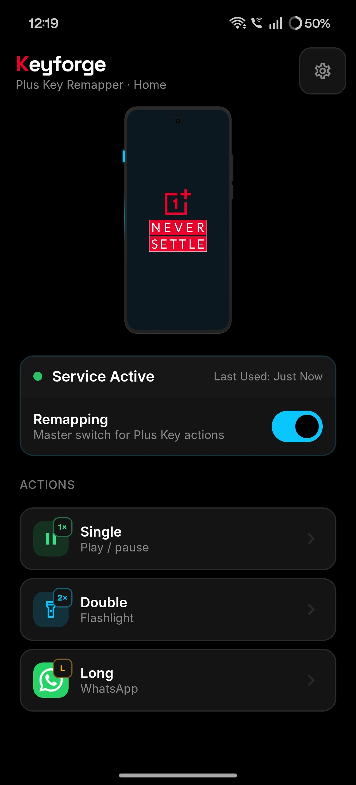
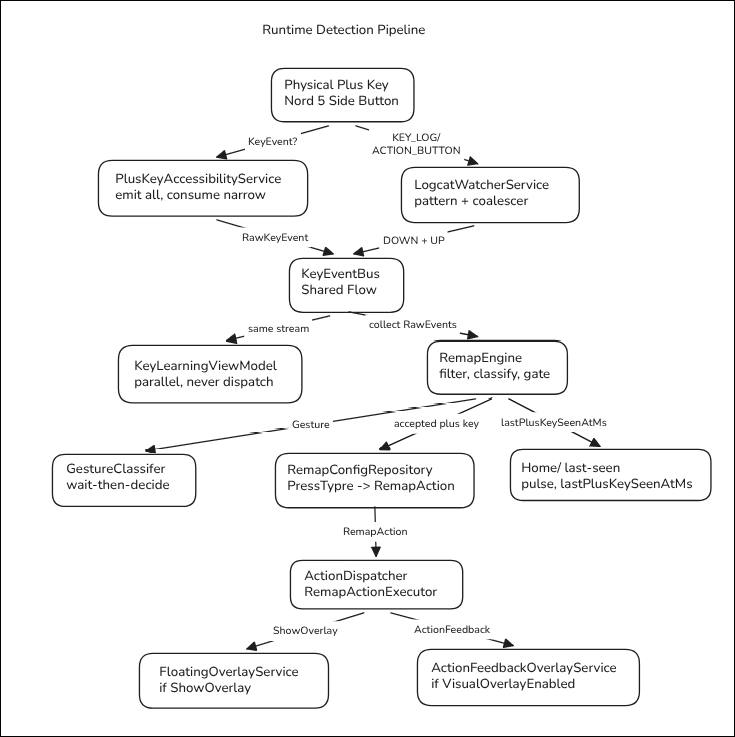
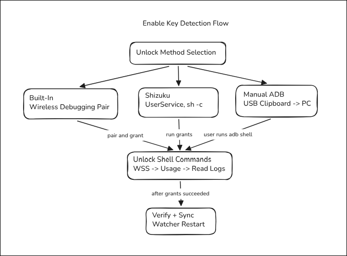
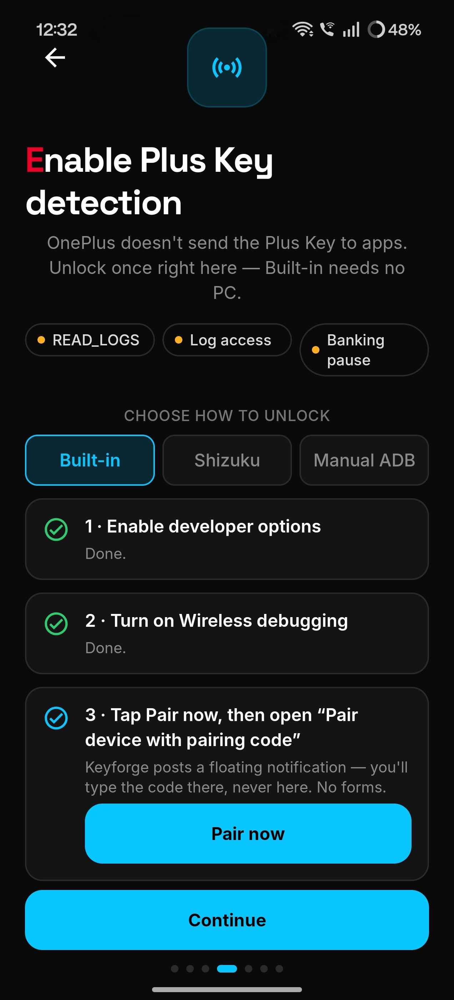
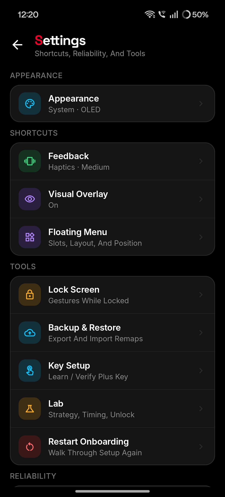
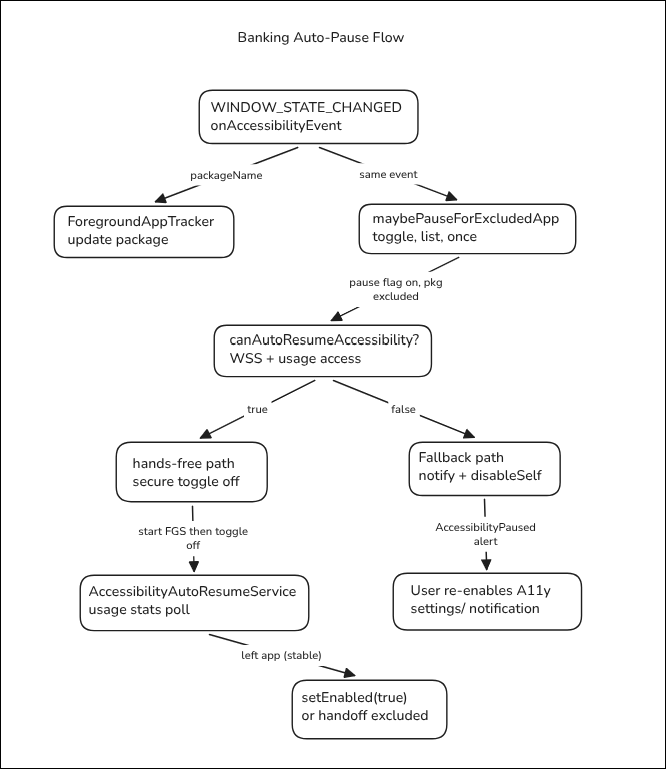
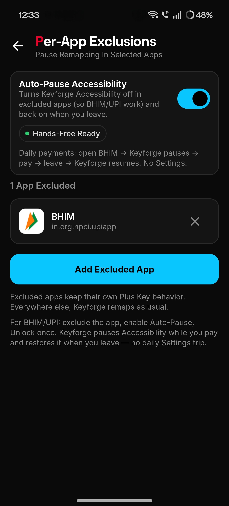

# Keyforge

**Remap the OnePlus Nord 5 Plus Key** — the physical side button marketed for AI — into *your* shortcuts: single press, double press, long press, plus an optional floating menu.

No root. No Magisk. No cloud. Local-only configuration.

> **Not affiliated with, endorsed by, or connected to OnePlus / OPPO.**

| | |
|---|---|
| Package | `com.nordairemapper` |
| Primary device | OnePlus Nord 5 (OxygenOS) |
| Min / target SDK | 33 (Android 13) / 35 |
| Stack | Kotlin · Jetpack Compose · Hilt · Room + DataStore |
| Latest APK | [latest-debug release](https://github.com/JathinShyam/NordAIRemapper/releases/tag/latest-debug) |

**New here?** Start with [Quick start](#quick-start-download) → [Onboarding](#onboarding--step-by-step-and-why) → [How detection works](#how-detection-works-plain-english). Prefer a narrative walkthrough? See the [journey blog draft](docs/blog/keyforge-journey-medium-draft.md).

---

## Why this exists

Stock Plus Key options are limited (flashlight, camera, Mind Space, and a few others). Power users want arbitrary apps, media, overlays, and system actions from that button.

I got the idea after watching [a YouTube video on customizing the Nothing Essential Key](https://www.youtube.com/watch?v=YhY94x3HL7o&t=356s) — that “side button, my shortcuts” workflow already exists there (often via a **paid** app). I searched for the same on **Nord 5** and found no solid remapper, so I built **Keyforge** myself. It is **free**.

On many phones, remappers can “hear” a side button like a normal key. **On Nord 5, OxygenOS usually handles the Plus Key inside system code** (`OplusKeyEventUtil` / `KEYCODE_ACTION_BUTTON_CLICK`), so it **often never arrives** as a normal key message to Accessibility.

That is the whole product problem:

| What you expect | What OxygenOS does |
|---|---|
| Apps can “see” the Plus Key like volume | Plus Key is eaten by system code |
| One permission dialog for remapping | `READ_LOGS` cannot be granted from a normal dialog |
| Remap always swallows the stock action | Without root, stock Plus Key may still fire (**dual-fire**) |

Keyforge is honest about that. It unlocks **log watching** once, keeps Accessibility for system actions, and lets you assign real remaps.

### Three jobs (plain English)

1. **Notice** the Plus Key press (even when the OS hides the normal key event).
2. **Unlock** a special permission so that noticing is allowed.
3. **Stay out of the way** for banking / UPI apps that reject Accessibility.

---

## What you get after setup

| Feature | What it means |
|---|---|
| **Single / Double / Long** | Three independent remaps on Home |
| **Action catalog** | Apps, media, system shortcuts, URL, floating overlay, or none |
| **Floating overlay** | Up to 6 slots (pill or radial) when you assign **Show overlay** |
| **Visual Overlay** | Brief on-screen popup when a remap fires (style, accent, glow, hold) |
| **Haptics** | On/off + Light / Medium / Heavy intensity |
| **Lock Screen** | Per-gesture allow/deny while locked |
| **Exclusions** | Skip remaps in chosen apps |
| **Auto-Pause Accessibility** | Turn Accessibility off inside excluded apps (so BHIM/UPI work) and back on when you leave |
| **Backup & Restore** | Export/import JSON + local snapshots |
| **Lab / Advanced** | Detection strategy, gesture timings, log pattern, unlock repair |

<div align="center">


<p><em>Home after setup: Remapping on, Service Active, and your three actions.</em></p>
</div>

---

## Quick start (download)

1. Open **[Latest Debug](https://github.com/JathinShyam/NordAIRemapper/releases/tag/latest-debug)**.
2. Install `NordAIRemapper-debug-latest.apk` (allow Install unknown apps).
3. Walk onboarding below — especially **Unlock detection**.
4. On Home, leave **Remapping** on and assign Single / Double / Long.

Every push to `main` also publishes an immutable `debug-<sha>` release so older builds stay available: [all releases](https://github.com/JathinShyam/NordAIRemapper/releases).

> **Signature tip:** debug builds (local and CI) share one committed keystore (`keystore/debug.keystore`), so updates install in place without uninstalling. Only mixing in an APK signed elsewhere triggers `INSTALL_FAILED_UPDATE_INCOMPATIBLE`.

---

## How detection works (plain English)

### Plan A — Accessibility (normal Android path)

Enable Accessibility for Keyforge. When the OS delivers a key press, the app can see it, decide if it’s the Plus Key, and run your action. Volume and power stay untouched.

### Plan B — System log (what Nord 5 usually needs)

When Plan A is tested on Nord 5, Key setup often fills with **volume** keys and the Plus Key is **missing**. That is expected — not a broken Accessibility toggle.

So Keyforge also watches the phone’s **system log** for a fingerprint of the Plus Key (default pattern `KEYCODE_ACTION_BUTTON_CLICK`). One physical press becomes one down + one up edge, then the same gesture engine as Plan A.

Think of it as:

- **Plan A** = hearing someone speak in the room  
- **Plan B** = reading the note they left when they won’t speak to you  

Accessibility stays required either way for **system actions** (screenshot, lock, recents, shade, quick settings, etc.).

### Detection strategies

| Strategy | In plain English | Nord 5 reality |
|---|---|---|
| **Auto** (default) | Use whatever works | Recommended |
| **Accessibility** | Only normal key messages | Plus Key often missing; volume may appear |
| **Logcat** | Watch the system log | Usual path for Plus Key; needs Unlock |

Under the hood, the log watcher can still run as a companion even if you pick Accessibility — so Nord 5 does not go dark.

```
Accessibility service  ─┐
                        ├──▶ KeyEventBus ──▶ RemapEngine ──▶ GestureClassifier
Logcat watcher         ─┘                      │
                                               ├── strategy + identity
                                               ├── exclusions / lock screen
                                               └── ActionDispatcher
```

<div align="center">


<p><em>Runtime detection pipeline — physical Plus Key → Accessibility and/or log watcher → shared bus → engine → gestures → actions / overlays.</em></p>
</div>

### Gestures (wait-then-decide)

| Gesture | What happens |
|---|---|
| **Long** | Hold past the long threshold (default 500 ms) from press-down |
| **Double** | Second tap inside the double window (default 300 ms) |
| **Single** | One tap, then wait for the double window — so it does not steal doubles |

After a gesture, Keyforge may still skip the action (learning mode, excluded app, lock-screen flag off, or action set to None).

---

## Onboarding — step by step (and *why*)

First launch walks several screens. You can skip some, but skipping **Unlock** usually means the Plus Key never remaps on Nord 5.

### 1. Welcome

Introduces the product: remap single, double, and long press on the Plus Key.

### 2. Accessibility — required

**What you do:** Settings → Accessibility → enable **Keyforge**.

**Why:**

- On some devices / firmwares, hardware keys can be filtered here (Plan A).
- Even when Plus Key detection uses the log, **system actions still need Accessibility**.
- The service observes hardware keys and which app is in front for exclusions — **not** your screen content or passwords.

If Key setup later shows volume keys but never the Plus Key, that is expected on Nord 5.

### 3. Unlock Plus Key detection — required on Nord 5

**What you do:** Complete **Enable Plus Key detection** / **Unlock** (same flow as Home banners / Lab).

**Why:** Android will not show a normal “Allow logs?” dialog for `READ_LOGS`. OnePlus rarely delivers the Plus Key as a normal key event, so the app must watch system log lines. That needs a one-time grant. Unlock can also grant the extras used for **banking Auto-Pause**.

Pick one method:

| Method | Best when |
|---|---|
| **Built-in** (Wireless debugging) | You want phone-only setup — no PC |
| **Shizuku** | You already use Shizuku |
| **Manual ADB** / USB | You have a computer and prefer a simple `adb` command |

**Preferred — USB (computer once):**

1. Enable USB debugging; use **File transfer**, not tethering-only.
2. On a computer (full Unlock bundle — order matters):

   ```bash
   adb shell pm grant com.nordairemapper android.permission.WRITE_SECURE_SETTINGS
   adb shell appops set com.nordairemapper GET_USAGE_STATS allow
   adb shell pm grant com.nordairemapper android.permission.READ_LOGS
   ```

   (`READ_LOGS` last — granting it can restart the app.)

3. In Unlock → **Recheck**. When chips look healthy, you can unplug.

If OxygenOS blocks grants (`GRANT_RUNTIME_PERMISSIONS`), disable **permission monitoring** under USB debugging / developer security settings, then retry.

**Advanced — no computer (Wireless debugging / Built-in):**

1. Developer options → **Wireless debugging** → turn on.
2. If you see Network name / Wi‑Fi address with **Allow** — that is network approval, **not** pairing. Tap Allow, then open the Wireless debugging **detail page**.
3. In Keyforge, tap **Pair now** → **Pair device with pairing code** → enter the 6-digit code in the **notification** (not a form in the app).
4. If connect fails after pairing: enter the **Connection port** from the Wireless debugging main page (**IP address & port**) — that port is **different** from the pairing port.
5. Grant succeeds → you may turn Wireless debugging **off**. Grants persist across reboots.

**What “unlocked” means:** log watching can see Plus Key presses; banking Auto-Pause can be hands-free; Accessibility stays on for system actions. Remapping still needs the master switch on Home.

<div align="center">


<p><em>Unlock methods converge on the same grants (secure settings → usage → read logs), then verify and restart the watcher.</em></p>
</div>

<div align="center">


<p><em>In-app Unlock: status chips, Built-in / Shizuku / Manual ADB, and Pair now (code typed in the notification).</em></p>
</div>

### 4. Display over other apps — optional

**What you do:** Allow **Display over other apps** for Keyforge.

**Why:** Required for the floating **Show overlay** menu and **Visual Overlay** action popup. Skip if you only want remaps that do not draw over other apps.

### 5. Keep it alive — strongly recommended

**What you do:**

- Allow **notifications** (foreground detection / overlay services)
- **Exempt from battery optimization** so OxygenOS does not kill the watcher overnight

**Why:** Log detection runs as a foreground service. Aggressive battery policies are the usual reason remaps “stop working after a while.”

### 6. You’re all set → Home

Confirm detection (Home shows Service Active / Last Used after a Plus Key press), then assign actions.

Settings keeps the rest of the product in one hub (Appearance, Shortcuts, Tools, Reliability):

<div align="center">


<p><em>Settings — Feedback, Visual Overlay, Floating Menu, Lock Screen, Backup, Key Setup, Lab, Restart Onboarding.</em></p>
</div>

---

## Permissions & Unlock (what each chip means)

| Permission / access | Section | Why we ask | “OK” looks like |
|---|---|---|---|
| Accessibility | Core | Keys when available + system global actions | Enabled |
| `READ_LOGS` | Core | See Plus Key in the system log on Nord 5 | Granted |
| Log visibility | Core | `logd` actually shares other apps’ lines (OxygenOS consent) | Visible |
| Display over other apps | Overlays | Floating menu + visual popup | Granted |
| Notifications | Reliability | Health / death alerts | Granted |
| Battery exemption | Reliability | Keep the watcher alive | Exempt |
| `WRITE_SECURE_SETTINGS` | Advanced | Hands-free banking Accessibility pause | Granted |
| Usage access | Advanced | Know when you left a banking app | Granted |
| Boot completed | Reliability | Re-arm watcher after reboot | (system) |
| Do Not Disturb access | Actions | DND / ring-vibrate-silent cycle | As needed |
| Modify system settings | Actions | Auto-rotate toggle | As needed |
| Camera (runtime) | Actions | Flashlight on stricter OEMs | As needed |
| Vibrate | Feedback | Haptics | As needed |

Backup uses the **Storage Access Framework** — no broad storage permission.

**Unlock grant order (do not reorder):** `WRITE_SECURE_SETTINGS` → usage access → `READ_LOGS` last. Putting `READ_LOGS` earlier can restart the app mid-setup and skip the rest.

**Privacy:** No accounts, analytics, ads, or cloud sync. Accessibility is not used to scrape screen content. Log matching stays on-device.

---

## Banking / UPI — Auto-Pause Accessibility

Many banking and UPI apps refuse to run while **any** Accessibility service is enabled. Soft exclusions (“don’t remap in BHIM”) are not enough — the bank checks the system list.

**Auto-Pause Accessibility** (Settings → Reliability → Exclusions):

1. Add the banking / UPI app to exclusions.
2. Turn **Auto-Pause Accessibility** on.
3. Complete Unlock once (so hands-free grants exist).
4. Open that app → Keyforge turns Accessibility **off**.
5. Leave the app → Keyforge turns it **back on** (or hands off if you jump to another excluded app).

| Mode | What it does | Does the bank still “see” Keyforge? |
|---|---|---|
| Soft exclusion only | Skip remaps in that app | Yes |
| Auto-Pause | Soft-disable Accessibility while inside excluded apps | No (while paused) |

Without elevated Unlock grants, Keyforge falls back to turning Accessibility off and asking you to re-enable it manually via a notification.

<div align="center">


<p><em>Auto-pause flow — excluded app opens → pause Accessibility → leave (or hand off) → resume.</em></p>
</div>

<div align="center">


<p><em>Exclusions — Auto-Pause on, Hands-Free Ready, BHIM excluded for daily UPI.</em></p>
</div>

---

## Background pieces (what’s running)

| Component | Kind | Role for you |
|---|---|---|
| `PlusKeyAccessibilityService` | Accessibility | Keys when available, which app is open, system actions |
| `LogcatWatcherService` | Foreground service | Watches system log for Plus Key |
| `FloatingOverlayService` | Foreground service | Multi-slot floating menu |
| `ActionFeedbackOverlayService` | Foreground service | Brief edge confirmation |
| `AccessibilityAutoResumeService` | Foreground service | Turns Accessibility back on after banking |
| `PairingGrantService` | Short foreground service | Finishes Wireless Unlock without dying mid-grant |
| `BootReceiver` | Boot | Re-sync watcher; open-after-boot / Accessibility alerts |

Useful notifications you may see:

| Alert | Meaning |
|---|---|
| Detection stopped | Accessibility / detection path torn down unexpectedly |
| Accessibility paused | Banking / exclusion auto-pause (or manual re-enable needed) |
| Logs blind | `READ_LOGS` present but the phone isn’t sharing other apps’ logs |
| Open after boot | Open Keyforge once after reboot so log watching can see the world |

---

## After onboarding — first remaps

1. On **Home**, leave remapping **on** (master switch).
2. Tap **Single**, **Double**, or **Long** → Remap studio → pick an action → **Try now** → **Done**.
3. Optional floating menu:
   - **Overlay settings** → Enable overlay → fill slots → layout/position
   - Assign **Show overlay** to a press type
4. Optional polish:
   - **Visual Overlay** — popup chrome when actions fire
   - **Feedback** — haptic intensity
   - **Lock Screen** — which gestures work while locked
5. Optional: set OxygenOS’s stock Plus Key action to something harmless to reduce dual-fire annoyance.

### Confirming detection

| Where | What good looks like |
|---|---|
| **Home** | Service Active; Last Used updates when you press Plus Key; no Unlock banner |
| **Key setup** (Settings → Tools) | Plus Key appears as a **logcat** row (volume via Accessibility is normal) |
| Remap **Try now** | Action runs (bypasses some gates — hardware press is the real test) |

### Lab / Advanced — when to touch it

Regular setup never requires this panel. It exists because OnePlus hides the Plus Key from normal apps, and that can change with firmware updates.

| Section | What it does | Touch it when |
|---|---|---|
| **Detection strategy** | Auto / Accessibility / Logcat | Almost never — keep Auto |
| **Unlock · Log access** | Re-run Built-in / Shizuku / Manual ADB | After reinstall or system update |
| **Log match pattern** | Fingerprint for Plus Key log lines | Presses stop after an OTA |
| **Gesture timing** | Double window / long threshold | Doubles feel too strict or loose |
| **Key identity** | Learned keyCode / scanCode | Support asks for diagnostics |

If everything works, leave Lab alone — engine bay, not dashboard.

---

## Remappable actions

| Category | Actions |
|---|---|
| Apps | Launch app · Open URL / deep link |
| Media | Play/pause · Next · Previous · Volume up/down |
| System | Assistant · Camera (front/rear) · Flashlight · Screenshot · DND · Ringer cycle · Shade · Quick settings · Recents · Home · Back · Lock · Auto-rotate |
| Overlay | Show floating overlay |
| None | Disable that press type |

Some actions need extra system access (e.g. **Do Not Disturb access** for ringer/DND, **Modify system settings** for auto-rotate). The app soft-fails with a toast and deep-link when possible.

---

## Known limitations

- **No root** → stock Plus Key action may still run (**dual-fire**). Documented, not a silent bug.
- **OS updates** can change log tags/patterns — editable in Lab if detection breaks after an update.
- **After reboot**, OxygenOS may require opening Keyforge once before cross-app logs are visible (open-after-boot nudge).
- **Other OxygenOS “Plus Key” phones** — best-effort; Nord 5 is the primary target.
- Debug APKs are for testing, not Play Store distribution.

---

## Build from source

```bash
git clone https://github.com/JathinShyam/NordAIRemapper.git
cd NordAIRemapper

# JDK 17
export JAVA_HOME="$HOME/.jdks/jdk17"   # or your JDK 17 path

# Point Gradle at the Android SDK (Android Studio also creates this)
echo "sdk.dir=$HOME/Android/Sdk" > local.properties

./gradlew :app:assembleDebug
```

APK: `app/build/outputs/apk/debug/app-debug.apk`

```bash
"$HOME/Android/Sdk/platform-tools/adb" install -r app/build/outputs/apk/debug/app-debug.apk
```

After install on a phone, prove the stack with:

```bash
scripts/device-smoke.sh
```

---

## Documentation

| Doc | Contents |
|---|---|
| [docs/blog/keyforge-journey-medium-draft.md](docs/blog/keyforge-journey-medium-draft.md) | Beginner-friendly journey + diagrams / screenshots |
| [docs/PRD.md](docs/PRD.md) | Product requirements & journeys |
| [docs/TRD.md](docs/TRD.md) | Technical contracts, permissions, detection rules |
| [docs/ARCHITECTURE.md](docs/ARCHITECTURE.md) | Pipelines, packages, ADRs |
| [docs/changes/](docs/changes/) | Per-change debug notes (why / what / verify) |
| [design/nord-edge-prototype.html](design/nord-edge-prototype.html) | Interactive Nord Edge UI prototype |
| [AGENTS.md](AGENTS.md) | Contributor / agent constraints |

---

## Contributing

1. Keep `./gradlew :app:assembleDebug` green (and unit tests for non-trivial changes).
2. Never hard-code Plus Key identity as the only detection path — learn at runtime / editable log pattern.
3. Do not pretend logcat events need `matchesPlusKey`; do not treat Accessibility as sufficient alone on Nord 5.
4. No analytics, ads, or OnePlus Sans font binaries in the repo.
5. Document non-trivial changes under `docs/changes/`.
6. Open a PR against `main` with device + strategy notes when you touch detection.

---

## License

Specify a license when you are ready to distribute (e.g. MIT / Apache-2.0). Until then, treat the code as source-available for personal use and review.

---

## Acknowledgements

Inspired by community Essential Key remappers for Nothing Phone and by [this YouTube walkthrough of customizing the Nothing Essential Key](https://www.youtube.com/watch?v=YhY94x3HL7o&t=356s) — the kind of “side button should do *my* shortcuts” experience that already exists in that ecosystem (often as a **paid** Play Store app).

I looked for the same thing on **OnePlus Nord 5** and found nothing that remapped the Plus Key the way I needed. So I built **Keyforge** myself. It is **free**, open for review, and not affiliated with Nothing, OnePlus, or any paid remapper on the Play Store.

Public OnePlus Plus Key workarounds (Accessibility filtering, logcat / `OplusKeyEventUtil`, Tasker / Shizuku discussions on XDA and elsewhere) also informed the Nord 5 path. This app’s preferred setup is **in-app Unlock** (USB or Wireless) — not Shizuku.
